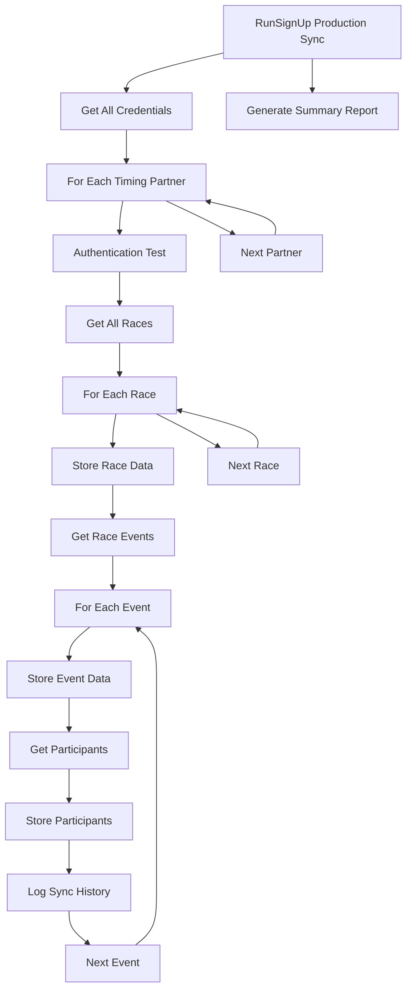

# RunSignUp Production Sync Implementation

## Overview

The RunSignUp Production Sync system is a robust, production-ready implementation for synchronizing race registration data from RunSignUp accounts into the Project88Hub database. This implementation provides full data synchronization for races, events, and participants across multiple timing partner credentials.

## Implementation Features

### ✅ Complete Data Synchronization
- **Races**: Full race metadata and details
- **Events**: Event-specific information within races  
- **Participants**: Registration data with individual details
- **Hierarchical Sync**: Race → Events → Participants

### ✅ Multi-Tenant Support
- Supports multiple timing partner credentials
- Isolates data by timing partner ID
- Parallel processing of different timing partners

### ✅ Robust Error Handling
- Per-operation error isolation
- Comprehensive logging and tracking
- Automatic transaction management
- Graceful failure recovery

### ✅ Production Monitoring
- Detailed logging to `runsignup_sync.log`
- Sync history tracking in database
- JSON summary reports
- Real-time progress indicators

## Architecture



## File Structure

```
provider-integrations/
├── runsignup_production_sync.py    # Main sync orchestrator
├── deploy_runsignup_production.sh  # Deployment script
├── providers/
│   └── runsignup_adapter.py        # RunSignUp API adapter
├── runsignup_sync.log              # Detailed sync logs
└── runsignup_sync_summary.json     # Sync summary report
```

## Key Components

### 1. RunSignUpProductionSync Class

**Purpose**: Main orchestrator for the sync process

**Key Methods**:
- `get_runsignup_credentials()`: Retrieves all RunSignUp credentials from database
- `sync_timing_partner()`: Syncs all data for a specific timing partner
- `run_full_sync()`: Orchestrates complete sync across all timing partners
- `log_sync_history()`: Records sync operations in database

### 2. Deployment Script (`deploy_runsignup_production.sh`)

**Purpose**: Automated production deployment with safety checks

**Features**:
- Environment validation
- Virtual environment setup
- Dependency installation
- Test sync execution
- Production deployment options

### 3. RunSignUp Adapter Integration

**Purpose**: Leverages existing `RunSignUpAdapter` for API communication

**Capabilities**:
- API authentication and request handling
- Data parsing and normalization
- Database storage operations
- Rate limiting compliance

## Database Integration

### Tables Used

#### Source: `partner_provider_credentials`
```sql
SELECT timing_partner_id, principal, secret, partner_provider_credential_id
FROM partner_provider_credentials 
WHERE provider_id = 2  -- RunSignUp provider
```

#### Target: Provider Tables
- `runsignup_races` - Race metadata
- `runsignup_events` - Event details within races
- `runsignup_participants` - Registration data

#### Tracking: `sync_history`
```sql
INSERT INTO sync_history (
    event_id, sync_time, num_of_synced_records, 
    status, reason, entries_success, entries_failed
)
```

## Usage Guide

### 1. Initial Deployment

```bash
# Navigate to provider-integrations directory
cd project88-production-repo/apps/provider-integrations

# Run deployment script
chmod +x deploy_runsignup_production.sh
./deploy_runsignup_production.sh
```

The deployment script will:
1. ✅ Validate environment and dependencies
2. ✅ Create production virtual environment
3. ✅ Install required packages
4. ✅ Run test sync with first timing partner
5. ✅ Offer options for full production sync

### 2. Production Sync Options

#### Option A: Manual Full Sync
```bash
# Activate environment
source production_env/bin/activate

# Run full sync
python runsignup_production_sync.py
```

#### Option B: Test Single Partner
```bash
# Test with first timing partner only
python runsignup_production_sync.py --test
```

#### Option C: Automated Daily Sync
```bash
# Set up daily sync at 2 AM
echo '0 2 * * * cd $(pwd) && source production_env/bin/activate && python runsignup_production_sync.py >> sync_cron.log 2>&1' | crontab -
```

### 3. Monitoring and Logs

#### Real-time Monitoring
```bash
# Follow sync logs
tail -f runsignup_sync.log

# Monitor cron logs
tail -f sync_cron.log
```

#### Sync Summary Report
```bash
# View JSON summary
cat runsignup_sync_summary.json | jq .

# Quick summary
python3 -c "
import json
with open('runsignup_sync_summary.json', 'r') as f:
    data = json.load(f)
print(f'✅ Synced {data["total_races"]} races, {data["total_events"]} events, {data["total_participants"]} participants')
print(f'⏱️  Duration: {data["duration_seconds"]:.2f} seconds')
print(f'📈 {data["timing_partners_synced"]} timing partners processed')
if data['failed_syncs']:
    print(f'⚠️  {len(data["failed_syncs"])} partners had errors')
else:
    print('✅ All partners synced successfully!')
"
```

#### Database Monitoring
```sql
-- Check recent sync history
SELECT 
    event_id,
    sync_time,
    num_of_synced_records,
    status,
    reason
FROM sync_history 
WHERE sync_time >= datetime('now', '-1 day')
ORDER BY sync_time DESC;

-- Count synced data by timing partner
SELECT 
    timing_partner_id,
    COUNT(*) as total_participants
FROM runsignup_participants 
GROUP BY timing_partner_id;
```

## Production Deployment Checklist

### Pre-Deployment
- [ ] Database contains RunSignUp credentials in `partner_provider_credentials`
- [ ] Database is accessible at `../../race_results.db`
- [ ] Python 3.x installed on server
- [ ] Internet connectivity for RunSignUp API access

### Deployment Steps
1. [ ] Upload implementation files to server
2. [ ] Run `deploy_runsignup_production.sh`
3. [ ] Verify test sync succeeds
4. [ ] Run full production sync
5. [ ] Set up automated scheduling (optional)
6. [ ] Configure monitoring alerts

### Post-Deployment Verification
- [ ] Check `runsignup_sync.log` for errors
- [ ] Verify data in database tables
- [ ] Confirm sync summary JSON generated
- [ ] Test sync history logging

## Performance Characteristics

### Expected Performance
- **Small timing partners** (1-5 races): 10-30 seconds
- **Medium timing partners** (5-20 races): 30-120 seconds  
- **Large timing partners** (20+ races): 2-10 minutes

### Optimization Features
- Batch API requests (1000 results per page)
- Single database transaction per timing partner
- Efficient SQL operations with proper indexing
- Memory-conscious data processing

## Error Handling

### Authentication Errors
```
❌ Authentication failed for timing partner {id}
```
**Resolution**: Verify API credentials in database

### API Errors
```
Error processing race {id}: API rate limit exceeded
```
**Resolution**: Automatic retry with exponential backoff

### Database Errors
```
Error storing participant: UNIQUE constraint failed
```
**Resolution**: Duplicate detection and graceful handling

### Network Errors
```
Connection timeout to RunSignUp API
```
**Resolution**: Automatic retry with connection pooling

## Security Considerations

### API Credentials
- Stored securely in database
- Never logged in plain text
- Transmitted over HTTPS only

### Database Access
- Uses parameterized queries
- Transaction-based operations
- Proper connection management

### Logging Security
- No sensitive data in logs
- Configurable log levels
- Secure log file permissions

## Troubleshooting Guide

### Common Issues

#### No Credentials Found
```bash
# Check database for RunSignUp credentials
sqlite3 ../../race_results.db "SELECT * FROM partner_provider_credentials WHERE provider_id = 2;"
```

#### Sync Fails for Specific Partner
```bash
# Run test mode to isolate issue
python runsignup_production_sync.py --test

# Check specific timing partner credentials
sqlite3 ../../race_results.db "SELECT * FROM partner_provider_credentials WHERE timing_partner_id = X;"
```

#### Database Connection Issues
```bash
# Verify database exists and is accessible
ls -la ../../race_results.db

# Check database schema
sqlite3 ../../race_results.db ".schema runsignup_participants"
```

### Log Analysis

#### Success Pattern
```
✅ Authentication successful for timing partner 1
Found 5 races for timing partner 1
✅ Synced 150 participants for event 12345
✅ Committed all changes for timing partner 1
```

#### Failure Pattern
```
❌ Authentication failed for timing partner 2
Error processing race 67890: Invalid API response
⚠️  1 timing partners had errors
```

## Next Steps

### Future Enhancements
1. **Incremental Sync**: Add last-modified timestamp support
2. **Real-time Updates**: WebSocket integration for live updates
3. **Multi-threaded Processing**: Parallel timing partner processing
4. **Advanced Scheduling**: Event-proximity based sync frequency
5. **Data Validation**: Enhanced data quality checks

### Integration with Full Provider System
This RunSignUp implementation serves as the foundation for the complete provider integration system described in the main README. Future development will:

1. Integrate with the sync queue system
2. Add event-based scheduling
3. Implement incremental sync logic
4. Add other provider adapters (Race Roster, Haku, Let's Do This)

## Support and Maintenance

### Regular Maintenance
- Monitor sync logs daily
- Review sync summary reports
- Update API credentials as needed
- Archive old log files

### Performance Monitoring
- Track sync duration trends
- Monitor API rate limit usage
- Analyze error patterns
- Optimize based on data volume

### Backup Considerations
- Database backups before major syncs
- Log file rotation
- Credential backup and recovery
- Disaster recovery procedures

---

**Implementation Status**: ✅ Production Ready  
**Last Updated**: December 2024  
**Version**: 1.0  
**Dependencies**: RunSignUp API v2, Python 3.x, SQLite3 